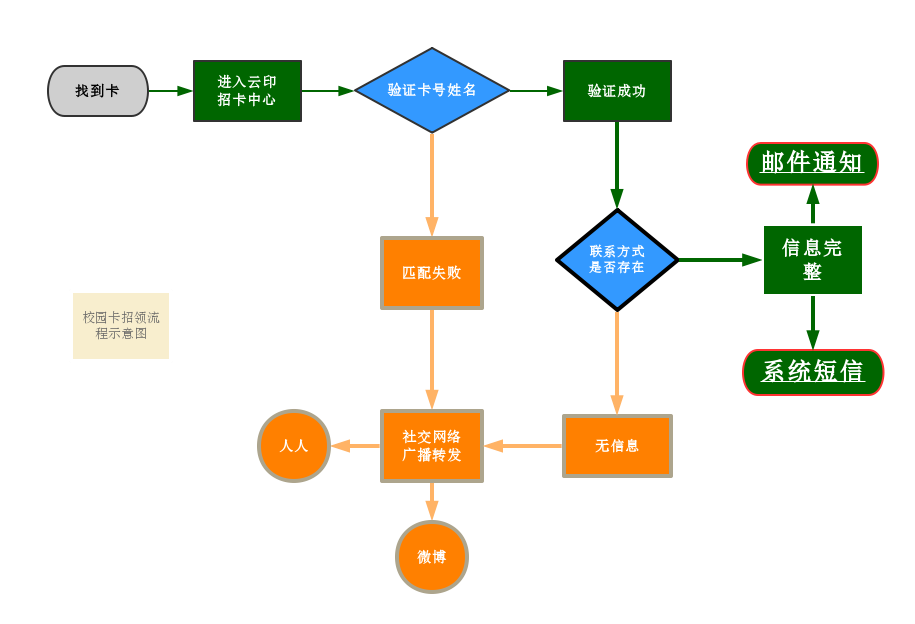

## 如何招领校园卡

目前只支持“招领”，暂不支持“寻物”。

不是发布“招领启事”，只是在这里验证一下失主的信息（```卡号``` 和 ```姓名```），然后告诉失主。

如果你捡到天大或者南开的同学的卡，只需要在[yunyin.org/Card](http://yunyin.org/Card),输入其```姓名```和```学号```。

### 理想的情况——点对点联系


如果丢卡同学的信息在云印系统数据中，并且没有关闭招领通知。

系统会直接通过短信和邮件告诉丢卡的同学如何和你联系。

然后剩下的事情就是TA联系你了，祝你们幸福♥。


### 最坏的情况——多平台广播

如果丢卡的同学信息不在系统中（多么悲伤的故事发生了！我们讨厌广播，但是为了通知到TA，我们没有更好的办法，只能让这个广播更方便！）

系统会启用广播功能，可立刻把招领信息推送到微博，人人，校内BBS等渠道。（对，**你并不用登陆这些平台，系统后台自动完成**！）

#### 微博
加入招领广播的官方微博的有：

* [云印南天](http://weibo.com/cloudPrint)（关注了解更多）
* 其他愿意加入的账号可以联系我们授权

#### 人人
加入招领广播的公关主页的有：

* [云印南天](http://page.renren.com/602117408)
* [南开大学失物招领处](http://page.renren.com/601492154)
* 其他愿意加入的主页可以联系我们授权

#### 校内BBS
BBS失物招领板块自动发帖

* [天大求实BBS](http://bbs.tju.edu.cn)(仅当失主是天大的同学时在此发布)
* [我爱南开BBS](http://bbs.nankai.edu.cn)(仅当失主是南开的同学时在此发布)

### PS：
	为了**不让大家满世界找丢卡的同学**,我们强烈建议大家在系统中完善自己的联系信息。
	为了防止滥用，我们对每个人使用频率有限制，同时设有```举报```和```感谢```反馈机制。

## 技术细节

### 信息和安全保证

云印南天对于用户信息安全极为重视，不收集任何非必需的信息。
对于用户敏感信息做多重加密处理。

* [我们如何保护密码](http://www.yunyin.org/pages/how-do-we-encrypt-password.html)
* [我们如何保护手机号和邮箱等](http://www.yunyin.org/pages/how-to-encrypt-phone-and-email.html)

### 流程




## 支持平台

### 社交接入

社交平台接入，由[云印社交聚合项目](https://github.com/YunYinORG/socail)提供支持。

### 短信支持

短信平台由[云之讯](http://www.ucpaas.com)提供支持